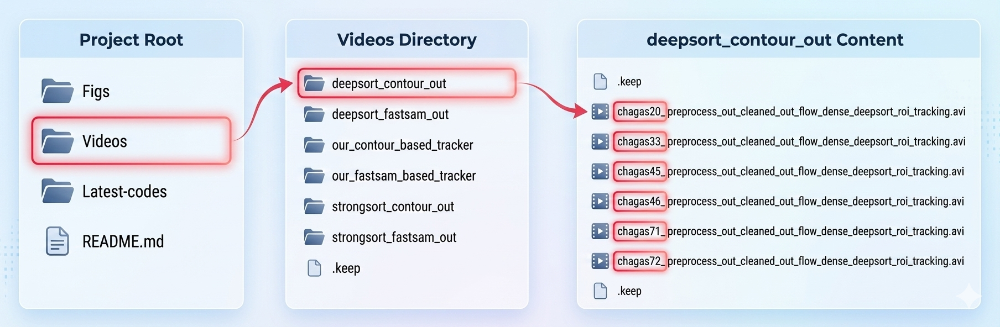

# Motion-Based Detection and Tracking of Trypanosoma cruzi Parasites in Microscopy Videos

### Video outputs placed in folder "Videos" for our tracker, deepsort and strongsort
The video outputs for our tracking systems have been systematically organized within the designated folder named **"Videos"**. This folder contains the visualization results for **OUR CUSTOM TRACKER , DeepSORT, and StrongSORT**.
Results for each tracking approach are presented using both **FastSAM and contour detection**. Folders named as according to tracker and detection techniques.

- Each video is named using the format **chagasX_****.avi**. In this format, X represents the video number (e.g., chagas20_*****.avi refers to video 20).
- The visual tracking results for the **DeepSORT** and **StrongSORT**, are provided in videos corresponding to the following sequences: 20, 33, 45, 46, 71, and 72.
- Individual processing steps for sequence **33** are provided as separate video files to demonstrate the tracker's operation.
- Additionally, outputs (our tracker) for other sequences are available in the **"other-outputs"** directory.

   

### Visual Interpretation Key
To correctly interpret the tracking results in all videos:
- **Detection Results**: The object detection bounding boxes are highlighted in Green.
- **Tracking IDs**: The unique identification labels assigned by the tracker to maintain object consistency across frames are represented by the corresponding IDs (e.g., ID 1, ID 2, etc.).
    
### Code Examination Starting Point
The primary file for code review and examination is designated as **main.py**. Please note that this file is subject to future updates.

### This file will be updated later on.. 
